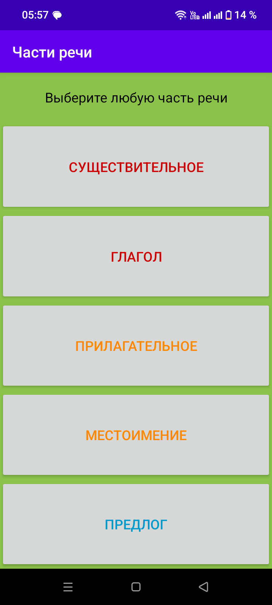
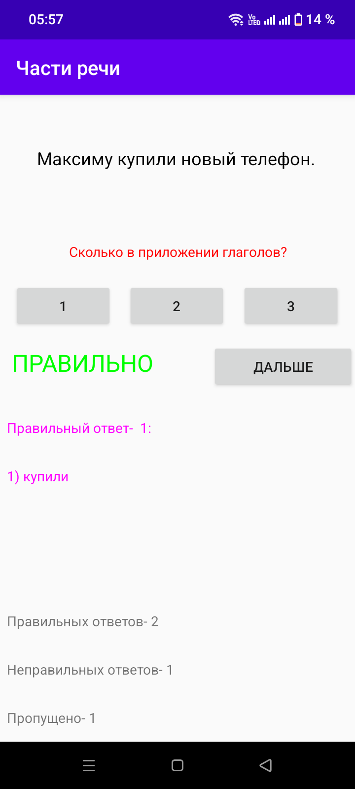
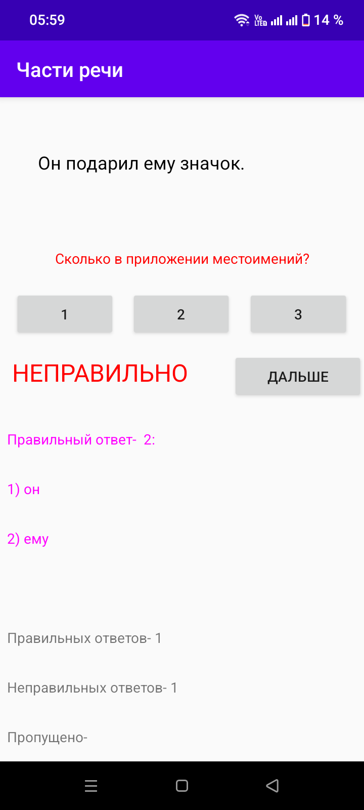
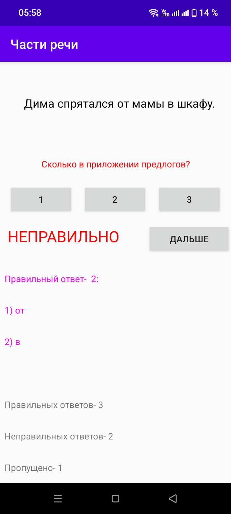

# 🧠 Части речи

---

### 📊 Статус проекта:
✅ **Полный функционал** — тренажер по частям речи работает  
✅ **Мгновенная проверка** — ответ проверяется сразу после нажатия  
✅ **Готов к использованию** — можно тренировать русский язык  

---

### 🎯 Что сделано:
- Android-приложение-тренажер по русскому языку на тему «Части речи»
- Выбор одной из пяти частей речи: существительное, глагол, прилагательное, местоимение, предлог
- Задания с предложениями и вопросом вида «Сколько в предложении …?»
- Три варианта ответа
- Мгновенная проверка: «ПРАВИЛЬНО» / «НЕПРАВИЛЬНО»
- Показ правильного ответа с перечислением найденных слов
- Статистика: правильные ответы, неправильные ответы, пропущенные

---

### 🏗 Архитектура проекта

Приложение разделено на **2 логических модуля**:

#### 📚 Выбор части речи
Главный экран с пятью разделами:
- **СУЩЕСТВИТЕЛЬНОЕ**
- **ГЛАГОЛ**
- **ПРИЛАГАТЕЛЬНОЕ**
- **МЕСТОИМЕНИЕ** 
- **ПРЕДЛОГ**

#### ❓ Тесты
Экран задания: предложение, вопрос «Сколько в предложении …?», три кнопки-варианта и кнопка «ДАЛЬШЕ». После выбора ответа:
- выводится вердикт **ПРАВИЛЬНО** (зелёный) или **НЕПРАВИЛЬНО** (красный),
- показывается правильный ответ со списком слов,
- обновляется счётчик: правильных / неправильных / пропущенных.

---

### 🛠️ Технологии:

| Компонент | Технологии |
|-----------|------------|
| **Язык** | Java |
| **Платформа** | Android (API 17+) |

---

### 📸 Галерея скриншотов

#### 🏠 Главный экран и викторина

👉 Нажмите, чтобы развернуть скриншоты

 

| Выбор части речи | Глагол (правильно) | Местоимение (неправильно) |
| :---: | :---: | :---: |
|  |  |  |
| **Предлог (неправильно)** | | |
|  | | |

---

### 📥 Скачать

Приложение можно скачать в RuStore:

**https://www.rustore.ru/catalog/app/com.example.zapisnayakniga**

---

### 📌 О проекте

> Проект разработан как портфолио-решение для демонстрации навыков разработки под **Android на Java**. Показывает работу с навигацией между Activity, обработкой пользовательского ввода, динамическим обновлением интерфейса, цветовым выделением элементов и ведением статистики ответов во время прохождения викторины.

---

### 📝 Лицензия

MIT. Свободное использование в образовательных целях.
